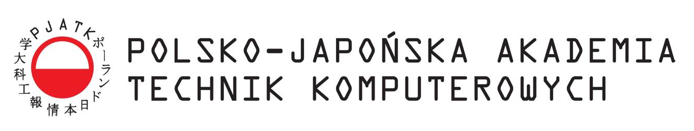

<!--
*** Thanks for checking out c. If you have a suggestion
*** that would make this better, please fork the repo and create a pull request
*** or simply open an issue with the tag "enhancement".
*** Thanks again! Now go create something AMAZING! :D
-->

<!-- PROJECT SHIELDS -->
<!--
*** I'm using markdown "reference style" links for readability.
*** Reference links are enclosed in brackets [ ] instead of parentheses ( ).
*** See the bottom of this document for the declaration of the reference variables
*** for contributors-url, forks-url, etc. This is an optional, concise syntax you may use.
*** https://www.markdownguide.org/basic-syntax/#reference-style-links
-->

[![Contributors][contributors-shield]][contributors-url]
[![Forks][forks-shield]][forks-url]
[![Stargazers][stars-shield]][stars-url]
[![Issues][issues-shield]][issues-url]
[![LinkedIn][linkedin-shield]][linkedin-url]
[![NO LICENSE][license-shield]][license-url]

<!-- PROJECT LOGO -->
 

  

  <h2 align="center">Master of Science (MSc) degree project</h2>

  

    <h4> A Generic Plugin for Automating the Implementation of Design Patterns in Integrated Development Environments for Polish-Japanese Academy of Information Technology </h4>
    <!--  
    <a href="https://github.com/dccstcc/SoftDrive_doc"><strong>» go to DOCUMENT »</strong></a>
     
      -->
    <!-- <a href="https://github.com/othneildrew/Best-README-Template">View Demo</a>
    ·
    <a href="https://github.com/othneildrew/Best-README-Template/issues">Report Bug</a>
    ·
    <a href="https://github.com/othneildrew/Best-README-Template/issues">Request Feature</a> -->
  

<!-- ABOUT THE PROJECT -->

## Project description

  This work describes the topic of design patterns used in modern programming languages. The advantages and disadvantages of their implementation were presented and the theoretical aspects of the patterns were presented. The constructed prototype generates individualized code templates with design patterns ready for integration. Pre-configuration of the generated pattern code through the generator parameterization mechanism facilitates integration with existing code. The parameters provided during configuration increase the compatibility of both implementations. Ways to integrate ready-made templates with existing design solutions were analyzed. The proposed solution was compared in terms of innovation with similar, already existing solutions. A positive effect of generating pattern templates is the lower consumption of resources necessary for their implementation in IT projects. The presented work describes: implementation, functionality and tools used to construct the prototype. The author of the work tries to show the benefits and possibilities of automating the process of implementing design patterns in integrated programming environments.

## Libraries and frameworks

This project use technology below.

- [![java][java-shield]][java-url]
- [![kotlin][kotlin-shield]][kotlin-url]
- [![intellij][intellij-shield]][intellij-url]

<!-- LICENSE -->

## License

This project has not a license.
All rights are reserved and it is not Open Source or free. You cannot modify or redistribute this code without explicit permission from the copyright holder, because projects which I realised are private conception from PJATK studies.
See `LICENSE` for more information.

<!-- CONTACT -->

## Contact

Dominik Stec - dccstcc@gmail.com

[![LinkedIn][linkedin-shield]][linkedin-url]

Project URL:
 
`https://github.com/dominik-stec/MSc_degree.git`

<!-- ACKNOWLEDGEMENTS
## Acknowledgements
* [GitHub Emoji Cheat Sheet](https://www.webpagefx.com/tools/emoji-cheat-sheet)
* [Img Shields](https://shields.io)
* [Choose an Open Source License](https://choosealicense.com)
* [GitHub Pages](https://pages.github.com)
* [Animate.css](https://daneden.github.io/animate.css)
* [Loaders.css](https://connoratherton.com/loaders)
* [Slick Carousel](https://kenwheeler.github.io/slick)
* [Smooth Scroll](https://github.com/cferdinandi/smooth-scroll)
* [Sticky Kit](http://leafo.net/sticky-kit)
* [JVectorMap](http://jvectormap.com)
* [Font Awesome](https://fontawesome.com)

-->

<!-- MARKDOWN LINKS & IMAGES -->
<!-- https://www.markdownguide.org/basic-syntax/#reference-style-links -->

[contributors-shield]: https://img.shields.io/github/contributors/dominik-stec/MSc_degree.svg?style=for-the-badge
[contributors-url]: https://github.com/dominik-stec/MSc_degree/graphs/contributors
[forks-shield]: https://img.shields.io/github/forks/dominik-stec/MSc_degree.svg?style=for-the-badge
[forks-url]: https://github.com/dominik-stec/MSc_degree/network/members
[stars-shield]: https://img.shields.io/github/stars/dominik-stec/MSc_degree.svg?style=for-the-badge
[stars-url]: https://github.com/dominik-stec/MSc_degree/stargazers
[issues-shield]: https://img.shields.io/github/issues/dominik-stec/MSc_degree.svg?style=for-the-badge
[issues-url]: https://github.com/dominik-stec/MSc_degree/issues
[license-shield]: https://img.shields.io/badge/License-NONE-orange
[license-url]: https://github.com/dominik-stec/MSc_degree/blob/master/LICENSE.md
[linkedin-shield]: https://img.shields.io/badge/-LinkedIn-black.svg?style=for-the-badge&logo=linkedin&colorB=555
[linkedin-url]: https://www.linkedin.com/in/dominik-stec
[product-screenshot]: images/screenshot.png
[java-shield]: https://img.shields.io/badge/-Java-red
[java-url]: https://www.java.com/en/
[kotlin-shield]: https://img.shields.io/badge/-Kotlin-blue
[kotlin-url]: https://kotlinlang.org/
[intellij-shield]: https://img.shields.io/badge/-IntelliJPlatformSDK-gold
[intellij-url]: https://plugins.jetbrains.com/docs/intellij/welcome.html

